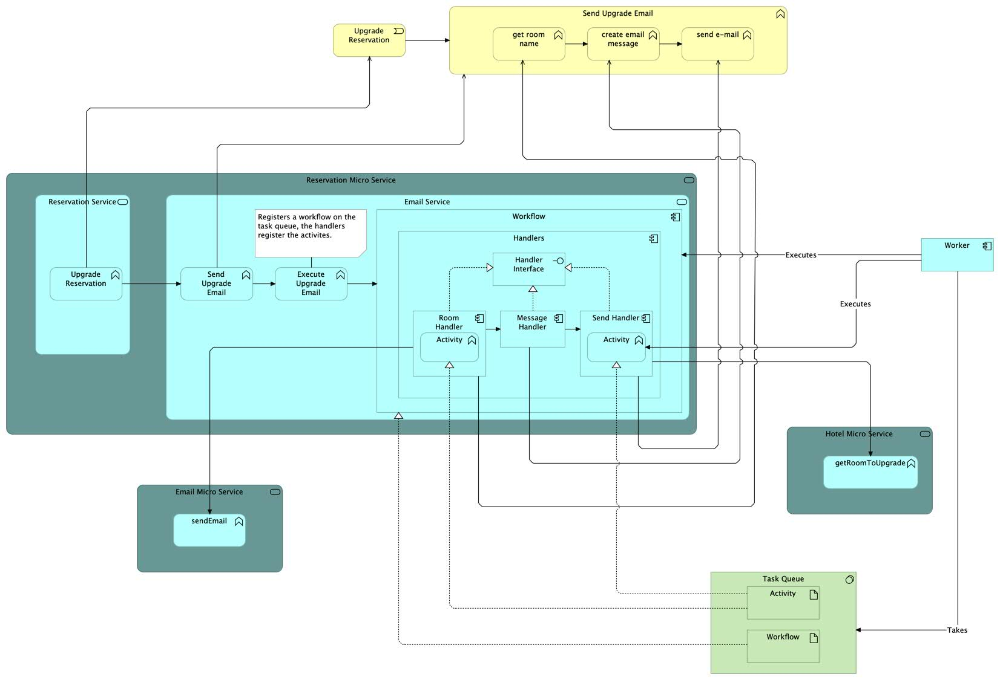

# Temporal POC

## Goals
Created a small POC for implementing Temporal.
My goals were:
- to keep low level abstractions(the way temporal stuff is executed) and higher level abstractions(business logic) separated as much as possible
- to allow for proper unit testing, with mocking certain parts
- to keep the Temporal surface as small as possible to prevent a vendor-lockin

This POC simulates the simplified version of upgrading an existing reservation, this upgrade consists of:
1. get the current room name for this specific reservation from a different microservice(mocked)
2. create an email message using this reservation and the fetched room name
3. calling the email microservice(mocked) to send this created e-mail to the user with the upgrade link

There are 2 non-deterministic pieces of logic involved with accompanied specific retry behavior, they are captured in Temporal activities:
1. getting the room name via http request
2. sending the e-mail via http request

## Running the POC

To run this project
1. open a terminal and navigate into the `TemporalServer` directory and run `docker compose up`
2. run the `worker/worker` *main* function
3. run the `start/main` *main* function

## Design choices

### Chain of Responsibility Pattern
[The Chain of Responsibility Design Pattern](https://refactoring.guru/design-patterns/chain-of-responsibility) is chosen as this creates an abstraction between the workflow
and the pieces of logic getting executed, and a logical separation between Temporal and non-Temporal code. This allows for cleaner code and better testability as well as a limited Temporal specific code surface.
It adheres to the *Single Responsibility Principle* and the *Open Closed Principle* costing a limited amount of overhead via using Go's embedding.

### Mocking the Workflow
In the `EmailWorkflow.go` the **UpgradeEmailWorkflowV3** function is kept at a minimum, it sets up the handler
and the receiver struct and passes it along to a handler.
This is designed this way due to 3 limitations imposed by *Temporal*.
1. All input to a workflow must be serializable
2. The `workflow.Context` can not be mocked
3. Everything not inside an activity inside a workflow must be deterministic

These limitations would mean having all logic inside the workflow that logic not bound to a Temporal activity can not be mocked in a clean way. This is because
there is no way to inject or access a mock handler or a mock handler factory into or from the workflow, as this makes a workflow non-deterministic, thus limiting the workflow unit test to actual used handlers.

Not being able to mock the `workflow.Context` results in not being able to test the **handleUpgrade** directly, because the activities wrapped in handlers do require to be called with a context
otherwise they panic. Therefore, keeping the workflow as minimal as possible is required, otherwise all this logic must be duplicated inside the unit tests because we create
a mock workflow which gets called by the Temporal testing environment passing in a `workflow.Context`.

#### Alternative Design
One alternative would be to create a handler factory which acts upon a serializable configuration object, which gets passed to the workflow.
I believe this solution would introduce a lot of overhead for every workflow ergo this solution was discarded.

## Archimate Diagram POC

